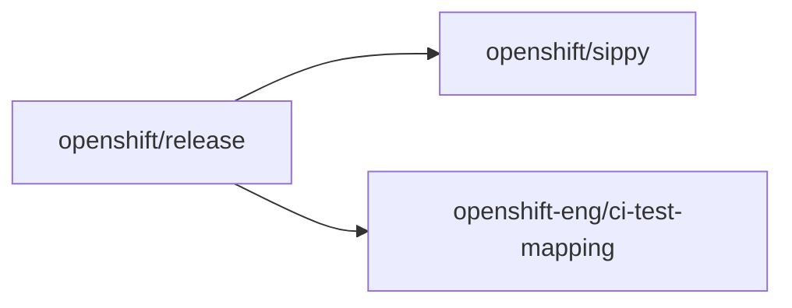

# LP OCP Compat Component Readiness onboarding

Onboard a Layered Product (LP) into Component Readiness (CR) via three PRs in **[openshift/release](https://github.com/openshift/release)**, **[openshift/sippy](https://github.com/openshift/sippy)**, and **[openshift-eng/ci-test-mapping](https://github.com/openshift-eng/ci-test-mapping)**. This skill replaces a manual multi-repo workflow that is error-prone (case sensitivity, identifier derivation, cross-repo coordination).

Authoritative file-edit rules: [Reporting Guide, Component Readiness](../../../docs/OCP_CI_Tutorials/Reporting/Reporting_Guide.md#component-readiness).

Full mock PR content for the MPEXOperator proof of concept: [references/worked-example-mpexoperator.md](references/worked-example-mpexoperator.md).

## Before starting

When `$ARGUMENTS` is present, parse each `key=value` token from the invocation (see `argument-hint` in the YAML frontmatter). Required keys: `lp-name`, `lp-slug`, `lp-repo`, `lp-branch`, `lp-ver`, `ocp-release`, `release-config`, `test-variant`, `cron`, `gh-user`, `make-maintainer`. Optional: `jira-component` (defaults to `LP--<lp-name>`). Treat `make-maintainer=user` as `requester`.

> Typical defaults when not supplied: `lp-slug` is the lowercased form of `lp-name`; `lp-branch` defaults to `main`; `lp-ver` defaults to `lpGA`.

If any required input is missing, stop and list what is needed.

Derive the **identifier table** from the [Reporting Guide, Onboarding Inputs](../../../docs/OCP_CI_Tutorials/Reporting/Reporting_Guide.md#onboarding-inputs) patterns and the validated inputs; do not invent values.

For the MPEXOperator proof of concept, when only product name, OCP release, fork owner, and `make-maintainer` are known, use the remaining parameter values from [Worked Example: MPEXOperator](references/worked-example-mpexoperator.md#invocation).

## At a glance

- **Phase 0:** create a temporary working directory (`$WORKDIR`); clone each fork (URLs derived from `gh-user`, see [Phase 0 workspace](#phase-0-workspace) example); configure `upstream` (official, push-blocked) and `origin` (fork) remotes; sync from `upstream`; create feature branch per repo.
- **`openshift/release` PR:** CR-compliant CI Operator Job Config; verify JUnit Test Suite (TS) prefix in Prow Job artifacts (via Job Rehearsal) before creating `openshift/sippy` and `openshift-eng/ci-test-mapping` PRs.
- **`openshift/sippy`:** `setLayeredProduct`, `config/views.yaml`, variant snapshot ([Step 1](../../../docs/OCP_CI_Tutorials/Reporting/Reporting_Guide.md#step-1----confirm-bigquery-job-pattern-match), [Step 2](../../../docs/OCP_CI_Tutorials/Reporting/Reporting_Guide.md#step-2----map-ci-operator-job-name-to-a-cr-variant-owner), [Step 6](../../../docs/OCP_CI_Tutorials/Reporting/Reporting_Guide.md#step-6----confirm-ts-import-pattern-coverage) usually skipped for standard LP OCP Compat).
- **`openshift-eng/ci-test-mapping`:** component package and registry ([Step 1](../../../docs/OCP_CI_Tutorials/Reporting/Reporting_Guide.md#step-1----register-ts-name-pattern) usually skipped).
- **Deliverables:** upstream PR URLs, local run log and shell trace (default `.cursor/skills/lp-ocp-compat-cr-onboarding/runs/`), cleanup `$WORKDIR`.

Every commit message must cite **`[ocp-ci-docs] lp-ocp-compat-cr-onboarding`**.

## Phase 0 workspace

```bash
#!/bin/bash
set -euxo pipefail; shopt -s inherit_errexit

typeset workDir
workDir="$(mktemp -d -t cr-onboarding-XXXXXX)"
typeset -A rmtURLs=(
    ["openshift/release"]="https://github.com/<gh-user>/release.git"
    ["openshift/sippy"]="https://github.com/<gh-user>/sippy.git"
    ["openshift-eng/ci-test-mapping"]="https://github.com/<gh-user>/ci-test-mapping.git"
)

pushd "${workDir}"
typeset upRmt
for upRmt in "${!rmtURLs[@]}"; do
    [ -d "${upRmt#*/}" ] || git clone --depth=1 --single-branch --no-tags "${rmtURLs[${upRmt}]}"
    pushd "${upRmt#*/}"
    git remote get-url upstream &>/dev/null || git remote add upstream "https://github.com/${upRmt}.git"
    git remote set-url --push upstream noPush
    git fetch --depth=1 --no-tags -pP origin main
    git fetch --depth=1 --no-tags -pP upstream main
    git switch main
    git reset --hard "upstream/main"
    git push --force-with-lease origin HEAD
    git switch -C cr-onboarding--<lp-slug>
    popd
done
popd
true
```

If Git cannot run, stop and report what is needed; do not apply unverified edits.

## Implementation order

Before generating edits, verify that expected anchor patterns exist in the cloned repos (e.g., `setLayeredProduct` in `openshift/sippy`, `pkg/components/` in `openshift-eng/ci-test-mapping`, CI Operator config directory layout in `openshift/release`). Halt with a clear message if the structure does not match expectations.



### [openshift/release](https://github.com/openshift/release)

See [CI Operator Job Configuration](../../../docs/OCP_CI_Tutorials/Reporting/Reporting_Guide.md#ci-operator-job-configuration).

- CI Operator Job full name must contain `-<lpVer>-lp-ocp-compat-cr--<lpname>-`.
- `.tests[].steps.env`: `MAP_TESTS: "true"`, `DR__RP__CR_COMP_NAME: lp-ocp-compat--<lp-name>`.
- `.tests[].cron` set to the value supplied via the `cron` argument.
- ExitTrap / JUnit post-processing when the CI Operator Step uses `mpiit-data-router-reporter` or `firewatch-ipi-aws-cr`.

### [openshift/sippy](https://github.com/openshift/sippy)

See [Sippy](../../../docs/OCP_CI_Tutorials/Reporting/Reporting_Guide.md#sippy). Standard LP OCP Compat: add [Step 3](../../../docs/OCP_CI_Tutorials/Reporting/Reporting_Guide.md#step-3----map-ci-operator-job-name-to-a-cr-variant-layeredproduct) `setLayeredProduct`, [Step 4](../../../docs/OCP_CI_Tutorials/Reporting/Reporting_Guide.md#step-4----include-product-in-lp-ocp-compat-views) `config/views.yaml`, [Step 5](../../../docs/OCP_CI_Tutorials/Reporting/Reporting_Guide.md#step-5----update-variant-snapshot) snapshot; skip [Step 1](../../../docs/OCP_CI_Tutorials/Reporting/Reporting_Guide.md#step-1----confirm-bigquery-job-pattern-match), [Step 2](../../../docs/OCP_CI_Tutorials/Reporting/Reporting_Guide.md#step-2----map-ci-operator-job-name-to-a-cr-variant-owner), [Step 6](../../../docs/OCP_CI_Tutorials/Reporting/Reporting_Guide.md#step-6----confirm-ts-import-pattern-coverage).

### [openshift-eng/ci-test-mapping](https://github.com/openshift-eng/ci-test-mapping)

See [CI Test Mapping](../../../docs/OCP_CI_Tutorials/Reporting/Reporting_Guide.md#ci-test-mapping). Standard LP OCP Compat: add `pkg/components/<lpComp>/` and registry entry; skip `includeSuitePatterns` when `lp-ocp-compat--%` already applies.

## Pull requests

- Push feature branch to fork `origin`.
- Open PR on upstream with `--head <gh-user>:<branch>`.
- Cross-link all three upstream PR URLs in every PR body; include identifier table and maintainer `make` lines not yet run. After all PRs are open, back-update each body with the full set of cross-links via `gh pr edit`.

Example:

```bash
gh pr create --repo openshift/sippy --head <gh-user>:<branch> --base main \
  --title "Onboard MPEXOperator for LP OCP Compat Component Readiness (Sippy)"
```

## Maintainer `make`

**Prerequisites for `make-maintainer=agent`:** Go toolchain, `make`, and all repo-specific dependencies must be available in the agent environment (`openshift/sippy` requires Go; `openshift-eng/ci-test-mapping` requires Go; `openshift/release` requires Python and `make`).

| Repo                             | Command                                                                              | When `make-maintainer` is `requester` or `user`  | When `make-maintainer` is `agent`    |
|----------------------------------|--------------------------------------------------------------------------------------|--------------------------------------------------|--------------------------------------|
| `openshift/sippy`                | `make update-variants`; `./sippy variants snapshot --config ./config/openshift.yaml` | Document in PR body only                         | Run, commit regenerated artifacts    |
| `openshift-eng/ci-test-mapping`  | `make mapping`                                                                       | Document in PR body only                         | Run, commit regenerated artifacts    |
| `openshift/release`              | `make update`                                                                        | Document in PR body only                         | Run, commit regenerated artifacts    |

## Run logging

Write under `.cursor/skills/lp-ocp-compat-cr-onboarding/runs/` (do not commit unless explicitly requested):

- `LP_OCP_Compat_CR_Run_<lpname>_<RUN_ID>_log.md`
- `LP_OCP_Compat_CR_Run_<lpname>_<RUN_ID>_commands.sh`

## References

- [Worked example: MPEXOperator](references/worked-example-mpexoperator.md)
- [Reporting Guide, Onboarding Inputs](../../../docs/OCP_CI_Tutorials/Reporting/Reporting_Guide.md#onboarding-inputs)
- [Reporting Guide, Sippy](../../../docs/OCP_CI_Tutorials/Reporting/Reporting_Guide.md#sippy)
- [Reporting Guide, CI Test Mapping](../../../docs/OCP_CI_Tutorials/Reporting/Reporting_Guide.md#ci-test-mapping)
