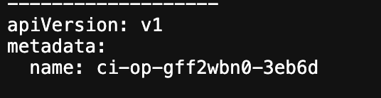
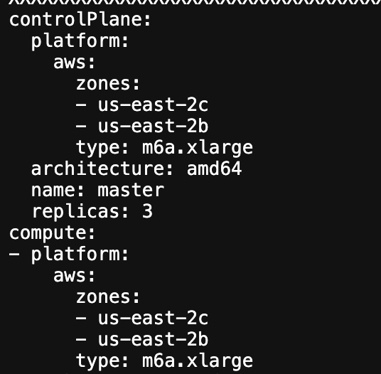
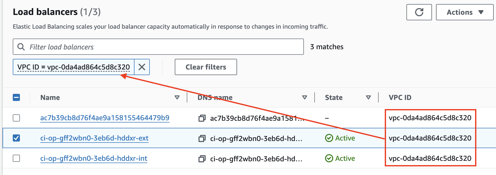

# OpenShift CI Container Creation Guide<!-- omit from toc -->

## Table of Contents<!-- omit from toc -->

- [Introduction](#introduction)
- [AWS](#aws)

## Introduction

Sometimes, a scenario can fail before a cluster is fully deprovisioned in a cloud-provider (at the time of writing this, we only use AWS). If that occurs, the Interop team is responsible for cleaning that cluster up in the cloud-provider account to avoid any unwanted cost. This document will serve as a guide to how to manually cleanup a cluster in the cloud-provider platforms we use.

## AWS

In order to cleanup a cluster in AWS, follow these steps:

1. Find the "name" of the cluster. Every cluster provisioned using OpenShift CI should have a unique name associated with it.
   - Navigate to the job's logs. For example: https://prow.ci.openshift.org/view/gs/test-platform-results/pr-logs/pull/openshift_release/47923/rehearse-47923-periodic-ci-konveyor-tackle-ui-tests-mta_6.1.1-mta-ocp4.14-lp-interop-mta-interop-aws/1749831891013341184
   - Click on "artifacts"
   - Navigate to `artifacts/job-name/ipi-install-install/build-log.txt`. The job name for the link provided above is "mta-interop-aws", for example.
   - The "name" of the cluster can be found under metadata -> name at the top of the file. In the example, the name is `ci-op-gff2wbn0-3eb6d`. 
2. Login to the [AWS console](https://aws.amazon.com/console/) and navigate to the correct region that your cluster was created.
   - Our self managed clusters are created in either "us-east-1" or "us-east-2". Our managed cluster creation is using "us-west-2". For self managed clusters you can confirm that region by looking at the zones in the `artifacts/job-name/ipi-install-install/build-log.txt` file used in step 1. . For managed clusters you can find the region in the file `artifacts/job-name/rosa-cluster-provision/build-log.txt`
3. Terminate EC2 instances.
   - Open the EC2 page
   - Select `Instances (running)`
   - Copy and paste the following into the search bar: `Name:CLUSTER-NAME`
     - Use the cluster name from step 1
     - Example: `Name:ci-op-gff2wbn0-3eb6d`
   - Select all of the EC2 instances from the resulting search
   - Click the "Instance State" dropdown and choose "Terminate instance"
   - Click "Terminate" in the dialog box and wait a minute or two to veriy the instances terminate
4. Delete NAT Gateways
   - Open the VPC page
   - On the left side of the screen, under "Virtual private cloud", select "NAT gateways"
   - Find the NAT gateways that start with the cluster name found in step 1
     - You can try to use the `Name:CLUSTER-NAME` search, but if that doesn't work, try pressing CTRL+f and searching for the cluster name
   - For each NAT gateway (probably 2 of them)
     - Select the gateway
     - Click the "Actions" dropdown and select "Delete NAT gateway"
     - Complete the confirmation (type "delete" in the textbox) and click "Delete"
5. Delete the Load Balancers
   - Open the EC2 page again
   - On the left side of the screen, under "Load Balancing", select "Load Balancers"
   - **NOTE:** Each cluster will have three load balancers associated with it. Two of them will be named starting with the cluster name, the third one will not. 
   - The easiest way to find all of the load balancers is to:
     - Locate one that has a name starting with the cluster name
     - Find the VPC ID associated with that load balancer
     - Copy and paste `VPC ID=*FOUND-VPC-ID*` where "FOUND-VPC-ID" is the ID you found above
     - This should show all three of the load balancers you need to delete 
   - Select all of the load balancers
   - Under the "Actions" dropdown, select "Delete load balancer"
   - Complete the verification task (type "confirm" in the textbox) and click the "Delete" button
6. Delete Network Interfaces
   - While on the EC2 Page
   - On the left side of the screen, under "Network & Security", select "Network Interfaces"
   - Use the `Name:CLUSTER-NAME` search to find the interfaces to delete. There should be 3.
   - Select all of the network interfaces
   - Under the "Actions" dropdown, select "Delete"
   - Click the "Delete" button in the new dialog box
7. Delete Volumes
   - While on the EC2 page
   - On the left side of the screen, under "Elastic Block Store", select "Volumes"
   - Use the `Name:CLUSTER-NAME` search to find the volumes to delete. There will be around 6.
   - Under the "Actions" dropdown, select "Delete volume"
   - Complete the verification task (type "delete" in the textbox) and click the "Delete" button
8. Delete the VPC
   - Open the VPC page again
   - On the left side of the screen, under "Virtual private cloud" select "Your VPCs"
   - Find the VPC that is associated with the cluster by using the `Name:CLUSTER-NAME` search.
   - Select the VPC
   - Under the "Actions" dropdown select the "Delete VPC"
   - Complete the verification task (type "delete" in the textbox) and click the "Delete" button
9. Delete IAM roles
   - Open the IAM page
   - On the left side of the screen, under "Access management", select "Roles"
   - Search just the name of the cluster, for example `ci-op-gff2wbn0-3eb6d` and press enter
   - Select any of the roles result from that search
   - Click the delete button
   - Complete the verification task (type "delete" in the textbox) and click the "Delete" button
