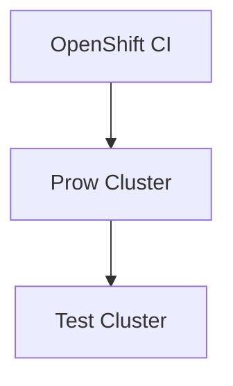

# OpenShift CI Container Creation Guide<!-- omit from toc -->

## Table of Contents<!-- omit from toc -->

- [Introduction](#introduction)
- [Container Creation and Usage](#container-creation-and-usage)
  - [Creating Containerized Tests](#creating-containerized-tests)
    - [The Test](#the-test)
    - [The Container](#the-container)
  - [Executing Containerized Tests in OpenShift CI](#executing-containerized-tests-in-openshift-ci)
    - [Define the Container](#define-the-container)
    - [Execute in the Container](#execute-in-the-container)

## Introduction

Before we discuss how to use containers in OpenShift CI, it is important to understand the basic structure of a CSPI test in OpenShift CI. 



`Figure 1: _Cluster Graph`

Figure 1 above shows a simple flowchart which illustrates that there are really two clusters provisioned when you execute a CSPI job in OpenShift CI.

1. **Prow Cluster**
   - The Prow cluster actually executes the various steps (chains, workflows, refs, _etc._) of a test.
   - The Prow cluster is not newly provisioned each time. There is a new project/namespace in this cluster that provisions and deprovisions for every execution of OpenShift CI.
2. **Test Cluster**
   - This cluster is created as part of a workflow when interop tests are run.
   - The `kubeconfig` in the Prow Cluster is configured to target this cluster. So when an `oc` (or other OpenShift interface) command is run in a step, it is run from the Prow Cluster targeting the Test cluster.

> **IMPORTANT:** 
> This guide is going to walk you through the creation of a container that runs in the _Prow Cluster_. This means that if you are trying to execute anything against your layered product, it will need to target the product that will be installed in the _Test Cluster_.

## Container Creation and Usage

The containers created for a specific scenario should be able to run any interop test written for that scenario. When writing the tests for a CSPI scenario, try to think about how they will be executed inside of a container as well as how you will target a separate cluster.

### Creating Containerized Tests

The following example uses a very simple Python test. This example is used to help understand the basic concept of testing within a container.

#### The Test

The tests in this example test simple math equations that should (hopefully) always be true. 

`test_mock_tests.py`

```python
def testAddition():
   assert 1+1 == 2

def testEquality():
   assert 1 == 1
```

When creating your tests, there shouldn't be much of a change outside of keeping in mind that you will need to target a cluster from outside of said cluster. Another thing to keep in mind is that resources located behind Red Hat's firewalls will not be accessible as both the _Prow Cluster_ and the _Test Cluster_ will be running outside of Red Hat's network..

> **IMPORTANT:**
> If your tests require any variables prior to executing the tests, please tell the CSPI team which variables are needed and (if possible) how to retrieve those variables. It is possible to get a variable (e.g. the web address of the test cluster) during a previous container's execution and that variable can be placed in a file in the `SHARED_DIR` for usage in other containers.

#### The Container

Now that we have tests created, we can create a Dockerfile that will build an image to run the tests. Before writing the Dockerfile, it can be helpful to list any requirements to run the tests. To run the tests above, the container will need:

1. Python
2. Pip
3. PyTest
4. The test files

Below is the Dockerfile we will use to execute our tests:

`Dockerfile`

```Dockerfile
# Using a Python base image fulfills our Python and pip requirements
FROM python:3.8

# Update container for good measure
RUN apt -y update

# Upgrade pip and install required packages
RUN pip install --upgrade pip # Just in case
RUN pip install pytest # Fulfills our PyTest requirement

# Copy the tests into /tmp/tests
RUN mkdir /tmp/tests
WORKDIR /tmp/tests
COPY . . # This copies our tests into the container, fulfilling the test files requirement

# Set required permissions for OpenShift usage
RUN chgrp -R 0 /tmp && \
    chmod -R g=u /tmp

# Run /bin/bash, we will execute the tests in a OpenShift CI step
CMD ["/bin/bash"]
```

### Executing Containerized Tests in OpenShift CI

Using a container is very easy in OpenShift CI. There are several ways it can be done (from a registry, a Dockerfile, an image stream, _etc._). However, for the purposes of this guide, we will focus on using the Dockerfile.

#### Define the Container

To define a container in OpenShift CI, two stanzas need to be added to the configuration file in OpenShift CI. Keep in mind, the configuration files in OpenShift CI are named based on the organization, repository, and branch of the test repository. So when we specify the Dockerfile's location or the context of the build, it is relative to the root of the testing repository. 

Pretend we have a test repository in the `CSPI-QE` organization named `mock_tests` and we'd like to use the `main` branch of the repository to test with. The configuration file in the `openshift/release` repository would be `ci-operator/config/cspi-qe/mock_tests/cspi-qe-mock_tests-main.yaml`. 

Inside of this pretend repository there is a directory named `dockerfiles` containing the Dockerfile we made above. In the root of the repository in the test file, `test_mock_tests.py`.

The following is an abbreviated version of the configuration file for our test repository. The most important stanzas to look at for this guide are:

- `build_root` 
  - The image defined in this stanza is the image that will be used in the container that actually builds your test image.
  - For our purposes, this doesn't matter a whole lot.
- `images`
  - This stanza defines the image we'd like to build from the Dockerfile written earlier in the pretend repository.

`cspi-qe-mock_tests-main.yaml`

```yaml
base_images:
  cli:
    name: "4.12"
    namespace: ocp
    tag: cli
build_root:
  image_stream_tag:
    name: release
    namespace: openshift
    tag: golang-1.13
images:
- context_dir: .
  dockerfile_path: dockerfiles/Dockerfile
  to: mock-runner
tests:
- as: mock-private-scenario
  interval: 960h
  steps:
    cluster_profile: aws-cspi-qe
    env:
      BASE_DOMAIN: aws.interop.ccitredhat.com
    test:
    - chain: interop-mock
    workflow: ipi-aws
```

In the `images` stanza, you can define multiple images to be built by simply adding another list item to the stanza. For our purposes, we are only defining one. You will need three key/value pairs to define the image to be built:

- `context_dir` - Defines the [build context directory](https://docs.docker.com/build/building/context/)
  - Remember, this is defined starting at the root of the test repository
  - We have used `.` above, meaning the build context is the root of the test repository
- `dockerfile_path` - Defines the path to the Dockerfile you'd like to build. This is also relative to the root of the test repository.
- `to` - Defines the name of the image created within OpenShift CI. This will be important later as we will use this name in a test step to make sure the commands are executed in the correct container.

Now that the image has been defined, it will be built and made available to test steps at the beginning of each execution.

#### Execute in the Container

To use the container in a step of the tests, you can specify that container in a ref's config file. For the purposes of this document, we will create a pretend ref in the step registry named `interop-mock-execute`. Below is the configuration file for this pretend ref: 

`ci-operator/step-registry/interop/mock/execute/interop-mock-execute-ref.yaml`

```yaml
ref:
  as: interop-mock-execute
  from: mock-runner
  commands: interop-mock-execute-commands.sh
  resources:
    requests:
      cpu: '1'
      memory: 500Mi
  documentation: |-
    Pretend ref...
```

In the config file above, the only line you will need to specify is the `from: mock-runner` line in the `ref` stanza. This specifies the name of the image you defined in the [Define the Container](#define-the-container) step of this guide. Specifying this container ensures that anything in the `ci-operator/step-registry/interop/mock/execute/interop-mock-execute-commands.sh` file will be executed in your new container.

Here is a brief example of the shell script to execute the tests in your container:

`ci-operator/step-registry/interop/mock/execute/interop-mock-execute-commands.sh`

```bash
#!/bin/bash

set -o nounset
set -o errexit
set -o pipefail

pytest /tmp/tests/test_mock_tests.py -vv --junitxml=${SHARED_DIR}/junit_output.xml
```

The shell script above utilizes `pytest` to execute the tests that were copied into the container in the [Creating Containerized Tests](#creating-containerized-tests) section of this guide. The JUnit results will be placed in the `SHARED_DIR` where they can be reported in later steps or other containers.
