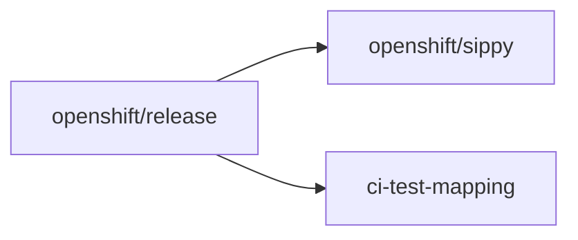

# Component Readiness — agent playbook

This playbook is for **coding agents and automation** that need to drive **layered-product LP Interop jobs** through **Component Readiness (CR)** end to end. It ties together several GitHub repositories and maintainer steps completed by the **user/requester**. Detailed procedures remain in the [Scenario Development Guide](../Scenario_Development/Scenario_Development_Guide.md) and [Reporting Guide](Reporting_Guide.md).

## Before you start: prerequisites (requester fills in)

Provide these **once per onboarding** so the agent does not guess identifiers or paths. Paste them into the [prompt template](#prompt-template-for-agent-execution) below.

1. **Product display name** — Name used in CR. Example: `MyProduct`.
2. **Product slug** — Lowercase, hyphenated; feeds `lp-interop-<slug>` and branch names. Example: `myproduct`.
3. **Target OCP minor release(s)** — OpenShift version(s) jobs exercise. Example: `4.22` (repeat or list if several streams). The requester does **not** supply a separate view string. Derive it from the release(s) and confirm the view exists for that minor.
4. **`openshift/release` config path(s)** — Existing or planned ci-operator config files. Example: `ci-operator/config/Org/repo/Org-repo-branch__variant.yaml`.
5. **Periodic job name fragment** — Substring for `setLayeredProduct` (often contains `-lp-interop-cr-`). Example: `-lp-interop-cr-myproduct`.
6. **OCPBUGS / mapping component** — For ci-test-mapping `DefaultJiraComponent` when known. Example: `MyProduct`.
7. **Remote / fork policy** — Where branches are pushed (personal fork vs bot). Example: `git@github.com:<user>/release.git`.
8. **Maintainer for `make`** — Who runs `make update`, `make update-variants`, `make mapping`. Example: **requester** or **agent**, per team policy.

Add links to **existing PRs**, **Prow jobs**, or **GCS artifacts** if this run extends prior work.

## Prompt template for agent execution

Copy everything inside the fence into the agent chat (or automation payload). Replace bracketed placeholders with the **prerequisites** above.

```text
You are executing LP Interop Component Readiness onboarding.

Inputs (from the user/requester — use exactly; do not invent):
- Product display name: [PRODUCT_DISPLAY_NAME]
- Product slug: [PRODUCT_SLUG]
- OCP release(s): [OCP_MINOR_LIST]
- Periodic job name substring: [JOB_SUBSTRING]
- openshift/release config file(s): [RELEASE_CONFIG_PATHS]
- OCPBUGS / DefaultJiraComponent (if known): [JIRA_COMPONENT]
- Git remote policy: [REMOTE_POLICY]
- Maintainer for make (who runs `make update`, `make update-variants`, `make mapping`): [MAKE_MAINTAINER]

Instructions:
1. Follow the repository playbook at docs/OCP_CI_Tutorials/Reporting/LP_Interop_CR_Agent_Playbook.md in this repo (Phase 0 tmpdir, clone order, branches from main, Cleanup).
2. Use **Maintainer for make** from `[MAKE_MAINTAINER]` (**requester** or **agent**, per team policy). If **requester**, record those `make` commands in PR descriptions for them to run—do not execute them yourself. If **agent**, run only what team policy explicitly allows; otherwise record commands like requester. Follow the Reporting Guide where automation is forbidden for agents (default for openshift/sippy and openshift-eng/ci-test-mapping unless policy overrides).
3. From OCP release(s), derive the correct Component Readiness Sippy `view=` name using openshift/sippy `config/views.yaml` (LP-Interop views for that minor—typically `<minor>-LP-Interop`). Do not ask the user/requester for a separate view string or invent one outside that mapping.
4. From **Product display name**, set the mapped JUnit suite and `DR__RP__CR_COMP_NAME` to `lp-ocp-compat--<lpName>` where `<lpName>` is taken from that display name; keep it identical everywhere (openshift/release, sippy, ci-test-mapping). Do not ask the user/requester for a separate mapped-suite string.
5. Open the **`openshift/release` ci-operator configs** at `[RELEASE_CONFIG_PATHS]` and inspect **`tests`** (job names, steps, workflow, commands, chain/ref, env) to determine **step-registry touchpoints** and the **`LayeredProduct`** value those jobs imply for Sippy—do not ask the user/requester to list those unless the YAML is incomplete or ambiguous.
6. Work in recommended order: openshift/release → openshift/sippy → openshift-eng/ci-test-mapping; optionally ocp-ci-docs if docs change.
7. End state: branches pushed, PRs opened with cross-links, playbook checklist satisfied, temporary WORKDIR removed per Cleanup section.

Deliverables: precise PR description text for each modified repo (ready to paste); summary list of PR URLs; remaining maintainer-only commands; any blockers.
```

## Repositories in scope

1. **[openshift/release](https://github.com/openshift/release)**
   - **a.** **CI configuration** — `ci-operator/config/**`, periodic job names, workflows (`Firewatch-ipi-aws-cr`), env vars (`DR__RP__CR_COMP_NAME`, `MAP_TESTS`, …).
   - **b.** **Step-registry changes** — apply test mapping in test scripts (commands/refs under `ci-operator/step-registry`).
2. **[openshift/sippy](https://github.com/openshift/sippy)** — Suite import patterns (`pkg/db/suites.go` **`testSuitePatterns`** / `testSuites`), variant / `LayeredProduct` mapping (`pkg/variantregistry/ocp.go`), LP-Interop views (`config/views.yaml`), tests.
3. **[openshift-eng/ci-test-mapping](https://github.com/openshift-eng/ci-test-mapping)** — Suite patterns, component packages, Jira component mapping (`config/openshift-eng.yaml`, `pkg/components/**`, `pkg/registry/registry.go`).

Supporting libraries (for example [RedHatQE/OpenShift-LP-QE--Tools](https://github.com/RedHatQE/OpenShift-LP-QE--Tools) for `ExitTrap--PostProcessPrep`) are consumed from CI scripts; they are **not** typically forked as part of this onboarding unless the scenario requires upstream changes there.

## Phase 0 — Sanitized workspace (mandatory before edits)

Every full onboarding run should start from a **clean, reproducible** layout so branches do not pick up stale commits or wrong bases.

1. **Temporary working root**  
   Create a fresh directory with `mktemp` (or equivalent) so nothing shares state with other worktrees—for example:

   ```bash
   WORKDIR=$(mktemp -d -t cr-onboarding-XXXXXX)
   cd "$WORKDIR"
   ```

   Perform **all** clones and git operations below inside this directory. Tear down the directory when the run is complete; see [Cleanup](#cleanup) below.

2. **Clone each repository** (HTTPS or SSH per site policy):

   ```bash
   git clone https://github.com/openshift/release.git
   git clone https://github.com/openshift/sippy.git
   git clone https://github.com/openshift-eng/ci-test-mapping.git
   ```

3. **Reset each repo to `main`** (or the repo’s default branch name if not `main`):

   ```bash
   cd release && git fetch origin && git checkout main && git pull --ff-only
   cd ../sippy && git fetch origin && git checkout main && git pull --ff-only
   cd ../ci-test-mapping && git fetch origin && git checkout main && git pull --ff-only
   ```

4. **Create one feature branch per repo**, from that updated `main`, using a **consistent slug** (examples **`onboarding-myproduct`** / **`myproduct`**):

   ```bash
   cd release && git checkout -b onboarding-myproduct
   cd ../sippy && git checkout -b myproduct
   cd ../ci-test-mapping && git checkout -b myproduct
   ```

5. **Record identifiers once** and reuse everywhere: mapped JUnit suite / `DR__RP__CR_COMP_NAME` (`lp-ocp-compat--<lpName>` from Product display name), **`LayeredProduct`** (from the configured **tests** in release YAML, aligned with Sippy), periodic job name substring (`-lp-interop-cr-<lpSlug>`). They must stay **case-consistent** across repos.

6. **Do not run forbidden automation**: In **sippy** and **ci-test-mapping**, agents must **not** execute `make` targets on behalf of the requester (see the Reporting Guide). Record maintainer commands in PR descriptions instead.

### Cleanup

After feature branches are pushed to the appropriate remotes and nothing further is required from the local working copies (commits, diffs, or tags), remove the temporary workspace so the next onboarding starts clean:

```bash
cd /
rm -rf "$WORKDIR"
```

Use the same `WORKDIR` value created in step 1 (`mktemp`). Change out of `$WORKDIR` before deleting it (for example `cd /` as above). If anything must be retained (notes, patch files), copy it elsewhere **before** running `rm -rf`.

## Recommended order of work

Dependencies flow **from CI reality → ingestion → mapping**:



1. **`openshift/release`** — Implement [Make a Job CR-Compliant](../Scenario_Development/Scenario_Development_Guide.md#make-a-job-cr-compliant): `-lp-interop-cr` naming, cron, `Firewatch-ipi-aws-cr`, `mpiit-data-router-reporter`, `MAP_TESTS`, `DR__RP__CR_COMP_NAME`, and [Map the JUnit tests output](../Scenario_Development/Scenario_Development_Guide.md#map-the-junit-tests-output). Confirm **`lp-ocp-compat--<lpName>`** derived from Product display name matches CI and that **real** periodic job name fragments match what Sippy and variants expect.

2. **`openshift/sippy`** — Follow [Reporting Guide → Sippy](Reporting_Guide.md#sippy): `pkg/db/suites.go` (**`testSuitePatterns`** / **`testSuites`**), `pkg/variantregistry/ocp.go` (`setLayeredProduct`), `config/views.yaml`, optional `pkg/variantregistry/ocp_test.go`. Respect substring **ordering** and LP-Interop view blocks.

3. **`openshift-eng/ci-test-mapping`** — Follow [Reporting Guide → CI Test Mapping](Reporting_Guide.md#ci-test-mapping): `includeSuitePatterns`, new component package, `pkg/registry/registry.go`, capabilities.

4. **`ocp-ci-docs`** (optional) — Align internal docs if process or naming changed.

Pull requests can open **in parallel** once identifiers are fixed, but **release** should merge **first** when possible so production job names and JUnit match what Sippy and ci-test-mapping encode.

## Maintainer hand-offs (not automated)

Record these explicitly in each PR so the **user/requester** can finish CI:

1. **`openshift/sippy`** — After Go changes to variant logic: run **`make update-variants`** (see Reporting Guide). Agents do **not** run this.
2. **`openshift-eng/ci-test-mapping`** — After config/component edits: run **`make mapping`** and review generated `data/` (see Reporting Guide). Agents do **not** run this.
3. **`openshift/release`** — Run **`make update`** / **`make jobs`** per project policy when changing configs or step-registry (outside this playbook’s automation rules).

## End-to-end checklist for the agent

- [ ] Phase 0: fresh clones, `main` checked out and pulled, feature branches created with the same slug.
- [ ] **release**: CR-compliant periodic job; mapped suite prefix equals `DR__RP__CR_COMP_NAME`; grace period / ExitTrap if mapping JUnit (Scenario Development Guide).
- [ ] **sippy**: **`testSuitePatterns`** covers your suite prefixes (add regex only for **new** prefixes); `setLayeredProduct` row ordered correctly; product added to relevant `*-LP-Interop` views in `config/views.yaml`.
- [ ] **ci-test-mapping**: `includeSuitePatterns`; component + matchers; `DefaultJiraComponent` verified per repo README.
- [ ] PR descriptions list **maintainer** commands (`make update-variants`, `make mapping`) and link related PRs across repos.
- [ ] **PR descriptions:** Supply a **precise**, valid PR description for **every** modified repo (for example **openshift/release**, **openshift/sippy**, **openshift-eng/ci-test-mapping**, and **ocp-ci-docs** if changed). Each description should state what changed, why, identifiers used (`LayeredProduct`, mapped suite / `DR__RP__CR_COMP_NAME`, job fragments), links to related PRs, and maintainer-only `make` steps—ready to paste when opening the PR.

## Further reading

- [Scenario Development Guide — Make a Job CR-Compliant](../Scenario_Development/Scenario_Development_Guide.md#make-a-job-cr-compliant)
- [Reporting Guide — Component Readiness](Reporting_Guide.md#component-readiness)
