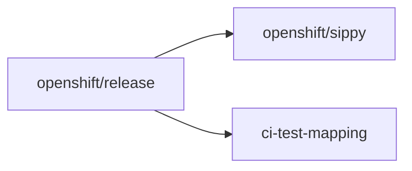

# Component Readiness — agent playbook

This playbook is for **coding agents and automation** that drive **layered-product LP Interop** work through **Component Readiness (CR)**. It coordinates **openshift/release**, **openshift/sippy**, and **openshift-eng/ci-test-mapping** (optional **ocp-ci-docs**). **User/requester** steps (for example `make`) stay in [Reporting Guide](Reporting_Guide.md) and [Scenario Development Guide](../Scenario_Development/Scenario_Development_Guide.md).

## At a glance (agents)

1. **Phase 0 first** — `WORKDIR`, clones (skip if dirs exist), `main`, feature branches, then **derive** identifiers from **`openshift/release`** YAML before editing other repos.
2. **Implement in dependency order** — **release** → **sippy** → **ci-test-mapping**; prefer **release** merging first.
3. **Do not run** `make` in **sippy** / **ci-test-mapping** unless `[MAKE_MAINTAINER]` is **agent** and policy allows; otherwise **record** maintainer commands in PR bodies.
4. **Every commit message** must cite `**[ocp-ci-docs] LP_Interop_CR_Agent_Playbook**` **as the source** of the procedure used.
5. **Deliverables** — Paste-ready PR descriptions per touched repo, PR URL list, remaining `make` steps, blockers; then **Cleanup** `WORKDIR`.

---

## Before you start: prerequisites (user/requester fills in)

Provide **once**; paste into the [prompt template](#prompt-template-for-agent-execution).

1. **Product display name** — CR name; drives **`<lpProductName>`** in **`lp-ocp-compat--<lpProductName>`**. Example: `MyProduct`.
2. **Product slug** — Lowercase, hyphenated; **`lp-interop-<slug>`** and branches. Example: `myproduct`.
3. **Target OCP minor release(s)** — e.g. `4.22`. Agent derives Sippy **`view=`** from **`openshift/sippy`** `config/views.yaml` (**`<minor>-LP-Interop`**); no separate view string from the requester.
4. **`openshift/release` config path(s)** — e.g. `ci-operator/config/Org/repo/Org-repo-branch__variant.yaml`.
5. **Periodic job name fragment** — For **`setLayeredProduct`** (often **`-lp-interop-cr-…`**). Example: `-lp-interop-cr-myproduct`.
6. **OCPBUGS / `DefaultJiraComponent`** — If known. Example: `MyProduct`.
7. **Remote / fork policy** — e.g. `git@github.com:<user>/release.git`.
8. **Maintainer for `make`** — **requester** or **agent**, per team policy.

Optional: links to existing **PRs**, **Prow** jobs, or **GCS** artifacts.

---

## Prompt template for agent execution

Copy the list below into the agent chat. Replace **`[PLACEHOLDERS]`** with prerequisites.

```text
You are executing LP Interop Component Readiness onboarding.

Inputs (from the user/requester — use exactly; do not invent):
- Product display name: [PRODUCT_DISPLAY_NAME]
- Product slug: [PRODUCT_SLUG]
- OCP release(s): [OCP_MINOR_LIST]
- Periodic job name substring: [JOB_SUBSTRING]
- openshift/release config file(s): [RELEASE_CONFIG_PATHS]
- OCPBUGS / DefaultJiraComponent (if known): [JIRA_COMPONENT]
- Git remote policy: [REMOTE_POLICY]
- Maintainer for make (who runs `make update`, `make update-variants`, `make mapping`): [MAKE_MAINTAINER]

Instructions (execute in this order):
1. Follow Phase 0 in docs/OCP_CI_Tutorials/Reporting/LP_Interop_CR_Agent_Playbook.md (WORKDIR, clone-if-missing, reset `main`, feature branches, identifier capture from **release** YAML, no forbidden `make`, commit-message rule). Run **Cleanup** only after branches are pushed and local clones are no longer needed.
2. With `[RELEASE_CONFIG_PATHS]` open: from **tests** (jobs, steps, workflow, commands, chain/ref, env), list **step-registry** paths to touch and confirm **`LayeredProduct`** implied for Sippy. Only ask the user/requester if YAML is incomplete.
3. From **OCP release(s)** + `openshift/sippy/config/views.yaml`, derive **`view=`** (**`<minor>-LP-Interop`**). Do not invent a view outside that file.
4. From **Product display name**, set **`DR__RP__CR_COMP_NAME`** / mapped suite to **`lp-ocp-compat--<lpProductName>`** (Scenario Development Guide for normalization). Same string in **release**, **sippy**, **ci-test-mapping**.
5. Honor `[MAKE_MAINTAINER]` for `make update`, `make update-variants`, `make mapping`: **requester** → document in PRs, do not run yourself unless policy says **agent** may. Default: no `make` in **sippy** / **ci-test-mapping** for agents (Reporting Guide).
6. Implement: **openshift/release** → **openshift/sippy** → **openshift-eng/ci-test-mapping**; Cross-link PRs. Prefer **release** merging first.
7. Every commit message: cite **[ocp-ci-docs] LP_Interop_CR_Agent_Playbook** as the **source** (short trailer or footer line is 
enough).
8. End state: branches pushed, checklist satisfied, **Cleanup** removes `$WORKDIR`.

Deliverables: paste-ready PR description per modified repo; list of PR URLs; maintainer-only commands left; blockers.
```

---

## Repositories in scope

1. **[openshift/release](https://github.com/openshift/release)**:
   **a.** **CI configuration** — `ci-operator/config/**`, periodic job names, workflows (`Firewatch-ipi-aws-cr`), env vars (`DR__RP__CR_COMP_NAME`, `MAP_TESTS`, …).
   **b.** **Step-registry changes** — apply test mapping in test scripts (commands/refs under `ci-operator/step-registry`).
2. **[openshift/sippy](https://github.com/openshift/sippy)**: **`testSuitePatterns`** in `pkg/db/suites.go` (add regex only for **new** suite prefixes; see Reporting Guide). `setLayeredProduct`, `config/views.yaml`, tests.
3. **[openshift-eng/ci-test-mapping](https://github.com/openshift-eng/ci-test-mapping)**: `includeSuitePatterns`, **`Matchers`** (**`Suite`** / **`SuiteRegEx`**), component package, `pkg/registry/registry.go`, capabilities.

Supporting libraries (for example [RedHatQE/OpenShift-LP-QE--Tools](https://github.com/RedHatQE/OpenShift-LP-QE--Tools) for `ExitTrap--PostProcessPrep`) are consumed from CI scripts; they are **not** typically forked as part of this onboarding unless the scenario requires upstream changes there.

## Phase 0 — Sanitized workspace (mandatory before edits)

Use one **`$WORKDIR`** for all git work; destroy it in [Cleanup](#cleanup).

1. **Working root**

   ```bash
   WORKDIR=$(mktemp -d -t cr-onboarding-XXXXXX)
   cd "$WORKDIR"
   ```

2. **Repos** — Clone only missing dirs under **`$WORKDIR`** (reuse if continuing):

   ```bash
   [ ! -d release ] && git clone https://github.com/openshift/release.git
   [ ! -d sippy ] && git clone https://github.com/openshift/sippy.git
   [ ! -d ci-test-mapping ] && git clone https://github.com/openshift-eng/ci-test-mapping.git
   ```

   For a **full** re-clone, remove those dirs or pick a new **`$WORKDIR`**.

3. **Sync `main`** (or default branch):

   ```bash
   cd release && git fetch origin && git checkout main && git pull --ff-only
   cd ../sippy && git fetch origin && git checkout main && git pull --ff-only
   cd ../ci-test-mapping && git fetch origin && git checkout main && git pull --ff-only
   ```

4. **Feature branches** — One slug across repos (examples **`onboarding-myproduct`** / **`myproduct`**):

   ```bash
   cd release && git checkout -b onboarding-myproduct
   cd ../sippy && git checkout -b myproduct
   cd ../ci-test-mapping && git checkout -b myproduct
   ```

5. **Identifiers** — After reading **`openshift/release`** configs from prerequisites, fix once: **`lp-ocp-compat--<lpProductName>`** / **`DR__RP__CR_COMP_NAME`**, **`LayeredProduct`**, periodic substring (**`-lp-interop-cr-<slug>`**). **Case-consistent** everywhere.

6. **No forbidden `make`** in **sippy** / **ci-test-mapping** for agents unless policy overrides — document **`make update-variants`** / **`make mapping`** in PRs ([Reporting Guide](Reporting_Guide.md)).

7. **Commit messages:** Every commit message must note that the work was generated using this playbook — reference **`[ocp-ci-docs] LP_Interop_CR_Agent_Playbook`** so reviewers can trace the workflow (one line in the body or as a trailer is sufficient).

### Cleanup

```bash
cd /
rm -rf "$WORKDIR"
```

Leave **`$WORKDIR`** first; copy anything to keep **before** `rm -rf`.

---

## Recommended order of work



1. **`openshift/release`** — [Make a Job CR-Compliant](../Scenario_Development/Scenario_Development_Guide.md#make-a-job-cr-compliant); [Map the JUnit tests output](../Scenario_Development/Scenario_Development_Guide.md#map-the-junit-tests-output). **`lp-ocp-compat--<lpProductName>`** and periodic fragments match what **sippy** will ingest.
2. **`openshift/sippy`** — [Reporting Guide → Sippy](Reporting_Guide.md#sippy): **`testSuitePatterns`**, `setLayeredProduct`, `config/views.yaml`, tests. Substring **order** matters.
3. **`openshift-eng/ci-test-mapping`** — [Reporting Guide → CI Test Mapping](Reporting_Guide.md#ci-test-mapping): `includeSuitePatterns`, **`Matchers`**, registry, capabilities.
4. **`ocp-ci-docs`** (optional) — Doc alignment.

PRs may open in parallel once identifiers are fixed; **release** should merge **first** when possible.

---

## Maintainer hand-offs (not automated)

Put in **each** PR for the **user/requester**:

1. **sippy** — `make update-variants` after variant edits (agents do **not** run by default).
2. **ci-test-mapping** — `make mapping` + review `data/` (agents do **not** run by default).
3. **release** — `make update` / `make jobs` per policy when config or step-registry changes.

---

## End-to-end checklist

- [ ] **Phase 0** — `WORKDIR`; repos cloned or reused; **`main`** + feature branches; identifiers captured from **release** YAML.
- [ ] **Commits** — Every message cites the playbook **as the source** (**`[ocp-ci-docs]  LP_Interop_CR_Agent_Playbook`**).
- [ ] **release** — CR job; **`DR__RP__CR_COMP_NAME`**; ExitTrap / grace if mapping JUnit ([Scenario Development Guide](../Scenario_Development/Scenario_Development_Guide.md#make-a-job-cr-compliant)).
- [ ] **sippy** — **`testSuitePatterns`** for prefixes; **`setLayeredProduct`** order; **`LayeredProduct`** in `*-LP-Interop` views.
- [ ] **ci-test-mapping** — `includeSuitePatterns`; **`Matchers`**; **`DefaultJiraComponent`**; README / `jira-verify` as needed.
- [ ] **PRs** — Maintainer **`make`** lines + cross-repo links + **paste-ready** per-repo descriptions (what / why / identifiers / related PRs).

---

## Further reading

- [Scenario Development Guide — Make a Job CR-Compliant](../Scenario_Development/Scenario_Development_Guide.md#make-a-job-cr-compliant)
- [Reporting Guide — Component Readiness](Reporting_Guide.md#component-readiness)
