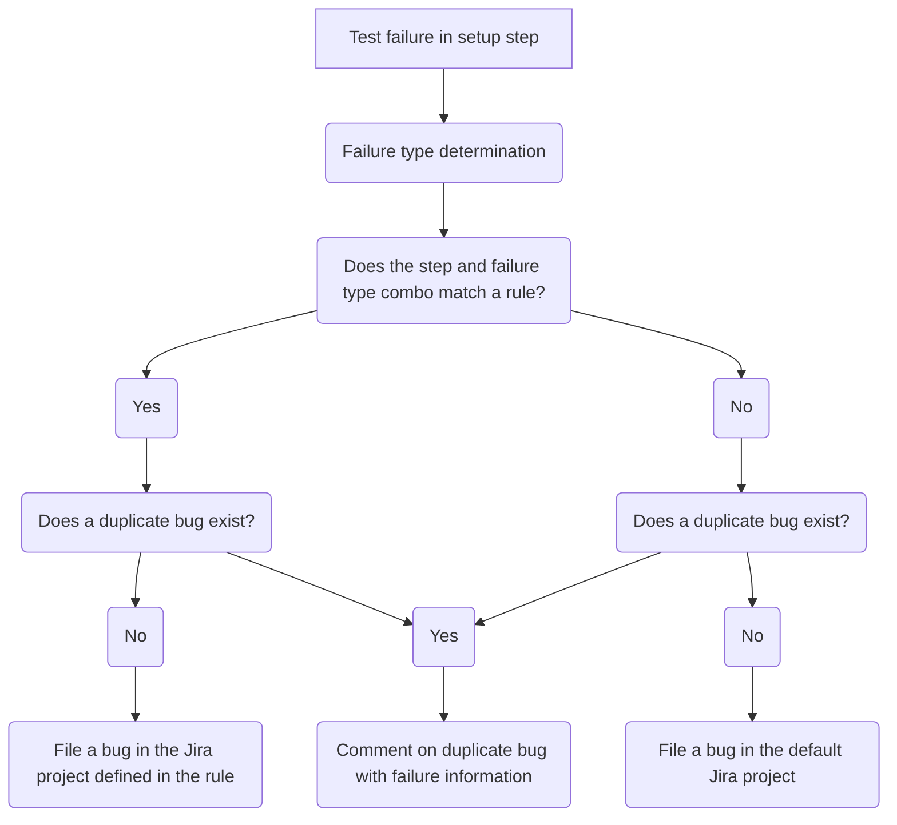

# Reporting Guide<!-- omit from toc -->

## Table of Contents<!-- omit from toc -->

- [TestGrid](#testgrid)
  - [What is TestGrid?](#what-is-testgrid)
  - [How do I Report Jobs to TestGrid?](#how-do-i-report-jobs-to-testgrid)
  - [TestGrid Dashboard Creation and Modification Automation](#testgrid-dashboard-creation-and-modification-automation)
- [Slack](#slack)
  - [How to Setup Slack Alerts for a Scenario](#how-to-setup-slack-alerts-for-a-scenario)
- [Failure Handling (Jira)](#failure-handling-jira)
  - [How Failures Are Reported to Jira](#how-failures-are-reported-to-jira)
    - [Example](#example)
  - [How To Add Jira Reporting to a Scenario](#how-to-add-jira-reporting-to-a-scenario)

## TestGrid

### What is TestGrid?

TestGrid is a Kubernetes community project that allows users to create dashboards of Prow job results. TestGrid uses its configuration files to build these dashboards, retrieve the Prow job results of all jobs defined in the dashboards, and displays the results in a grid pattern.

Please see the following resources for more information about TestGrid:

- [TestGrid Homepage](https://testgrid.k8s.io/)
- [TestGrid Documentation and Source Code](https://github.com/kubernetes/test-infra/tree/master/testgrid)

### How do I Report Jobs to TestGrid?

We have been able to eliminate a manual process for reporting jobs to TestGrid. The most important thing to know about how jobs are reported to the `-lp-interop` dashboards in TestGrid is that the automation that makes it happen looks for the unique identifier `-lp-interop` in the name of the Prow job.

As you may have read in other documents in this repository, you will need to append `-lp-interop` to the end of of your configuration file's filename when you create it. When we create configuration files in OpenShift CI, as you may know, the format for the filenames is `{GitHub Organization}-{GitHub Repository}-{Branch}__****.yaml`. After the `{Branch}` section of the filename, anything can be appended to the end. The text appended to the end is called a "variant". The use of variants will come in handy if we test multiple versions of a layered product or of OpenShift. Please add `-lp-interop` to the "variant" section of the filename.

**Examples:**

- `ci-operator/config/windup/winup-ui-tests/windup-windup-ui-tests-main-lp-interop.yaml`: Will be reported because `-lp-interop` is in the filename.
- `ci-operator/config/windup/winup-ui-tests/windup-windup-ui-tests-main.yaml`: Will NOT get reported because `-lp-interop` is not found in the filename.
- `ci-operator/config/windup/winup-ui-tests/windup-windup-ui-tests-main__ocp412-mtr-123-lp-interop.yaml`: Will be reported because `-lp-interop` is found in the filename.

### TestGrid Dashboard Creation and Modification Automation

The automation we use to automatically create and modify dashboards in TestGrid can be found in the [openshift/ci-tools](https://github.com/openshift/ci-tools) repository. We utilize the [testgrid-config-generator] tool in that repository to find any Prow jobs that contain either `-lp-interop` in their names. If a new Prow job is found that isn't being reported, the tool will create a new dashboard or modify an existing dashboard to report that job to TestGrid appropriately. After the tool has run, it will create a pull request in the [kubernetes/test-infra][kubernetes-test-infra] repository to finalize the changes.

The [testgrid-config-generator] tool is run daily and you should not need to force it to run. After the tools runs, it may take some time for the pull request to be merged into the [kubernetes-test-infra] repository. Once the pull request is merged, it will start to show in TestGrid.

To add support for automatically detecting layered product interoperability jobs, a [PR](https://github.com/openshift/ci-tools/pull/3289) was opened to [testgrid-config-generator] support these unique identifier.

> **NOTE:**
>
> The only Prow jobs that will be automatically reported in TestGrid are the jobs in the `main` branch of the [openshift/release](https://github.com/openshift/release).

## Slack

[OpenShift CI allows to set up Slack alerts](https://docs.ci.openshift.org/docs/how-tos/notification/) for our scenarios. The CSPI Interop team has decided that we should set up this Slack integration for each of our scenarios. Each scenario should alert to the Slack channel that product QE decides. The channel must be public and in redhat-internal.slack.com.

### How to Setup Slack Alerts for a Scenario

1. In the [openshift/release](https://github.com/openshift/release) repository, after you have created a configuration file for your scenario in the `ci-operator/config/...` directory and ran the `make update` or `make jobs` command, you should be able to find a `job` file for your config generated under `ci-operator/jobs/....`. Find the job file that ends in `-periodics.yaml` and open it.
2. This file may contain multiple periodic jobs for the same repository, so find the periodic job that matches the config you'd like alerts for. If you are working with layered product interop testing, the name should include `-lp-interop`. In this example, the job's name is `periodic-ci-windup-windup-ui-tests-v1.0-mtr-ocp4.13-lp-interop-mtr-interop-aws`.
3. Add a reporter_config stanza, replace the `channel:` value with the channel you're PQE team would like to use and update the `report_template:` with a different message (if you'd like to, this one is very generic and will work in most cases):

```yaml
  name: periodic-ci-windup-windup-ui-tests-v1.0-mtr-ocp4.13-lp-interop-mtr-interop-aws
  reporter_config:
    slack:
      channel: '#mtr-interop'
      job_states_to_report:
      - success
      - failure
      - error
      report_template: '{{if eq .Status.State "success"}} :slack-green: Job *{{.Spec.Job}}*
        ended with *{{.Status.State}}*. <{{.Status.URL}}|View logs> {{else}} :failed:
        Job *{{.Spec.Job}}* ended with *{{.Status.State}}*. <{{.Status.URL}}|View
        logs> {{end}}'
```

4. Commit your changes and open a Pull Request

> **IMPORTANT**
>
> Please see the [official documentation](https://docs.ci.openshift.org/docs/how-tos/notification/) for more information about how to configure Slack alerts further.


[testgrid-config-generator]: https://github.com/openshift/ci-tools/tree/master/cmd/testgrid-config-generator
[kubernetes-test-infra]: https://github.com/kubernetes/test-infra

## Failure Handling (Jira)

### How Failures Are Reported to Jira

Failures are reported to Jira using the [firewatch tool](https://github.com/CSPI-QE/firewatch). This tool is used to react to failures in OpenShift CI jobs. This tool uses a configuration defined for each scenario to help it determine how it should report certain bugs. For a more technical understanding of how to use the tool and build the configuration properly, please see the documentation below:

- [Getting started](https://github.com/CSPI-QE/firewatch/blob/main/README.md)
- [How to define the configuration](https://github.com/CSPI-QE/firewatch/blob/main/docs/cli_usage_guide.md#defining-the-configuration)

#### Example

For the purposes of how this automation works, here is a fairly simple example:

Each job/scenario in OpenShift CI consists of different steps, for this example we will say our scenario has three steps: `setup`, `test`, and `teardown`. In each of these steps, as far as the automation is concerned, there are two types of failures: `pod_failure` which means the step's script exited with a non-zero exit code and `test_failure` which means the step generated a JUnit XML file and a failure in the XML was found.

For this example, lets set some plain-english rules to make it a little easier to understand:

- If there is any type of failure in the `setup` step, report it to Interop QE (INTEROP Jira project)
- If there is any type of failure in the `teardown` step, report it to Interop QE (INTEROP Jira project)
- If there is a `pod_failure` found in the `test` step, report it to Interop QE (INTEROP Jira project)
- If there is a `test_failure` found in the `test` step, report it to Product QE (PQE Jira project)

Using the logic outlined above, we can generate a firewatch config that will result in bugs being filed to the right teams with as much information as possible to help the engineer looking at the bug. The configuration for this logic would look something like this:

```json
{
"failure_rules":
[
  {"step": "setup", "failure_type": "all", "classification": "Lorem Ipsum", "jira_project": "INTEROP", "group": {"name": "cluster", "priority": 1}, "jira_additional_labels": ["!default"]},
  {"step": "test", "failure_type": "pod_failure", "classification":  "Lorem Ipsum", "jira_project": "INTEROP", "group": {"name": "lp-tests", "priority": 1}, "jira_additional_labels": ["!default", "interop-tests"]},
  {"step": "test", "failure_type": "test_failure", "classification":  "Lorem Ipsum", "jira_project": "PQE", "group": {"name": "lp-tests", "priority": 1}, "jira_additional_labels": ["!default", "interop-tests"]},
  {"step": "teardown", "failure_type": "all", "classification": "Lorem Ipsum", "jira_project": "INTEROP", "group": {"name": "cluster", "priority": 2}, "jira_additional_labels": ["!default"]}
]
}
```

For the sake of this documentation, we will not go very deep into this configuration (again, see the documentation linked above) but this configuration will result in the plain-english rules we outlined earlier. Here is a highly-simplified flowchart of how this works:



### How To Add Jira Reporting to a Scenario

**If you currently use the ipi-aws workflow:**

1. Ask your PQE contact which Jira project they would like test failures to be reported to
2. Modify the scenario to use the `firewatch-ipi-aws` workflow instead of the `ipi-aws` workflow
3. Add the required environment variables:
   - `FIREWATCH_DEFAULT_JIRA_PROJECT`: This is the Jira project you'd like tickets to be filed to if the failure found does not match any rules. For Interop QE, this will probably be set to `LPINTEROP`
   - `FIREWATCH_CONFIG`: Where we define the rules for which tickets get filed where. Please see the [How to define the configuration](https://github.com/CSPI-QE/firewatch/blob/main/docs/cli_usage_guide.md#defining-the-configuration) section of the Firewatch documentation for help defining this variable.
   - `FIREWATCH_JIRA_SERVER`: `https://issues.redhat.com`
     - This value always defaults to the stage server to avoid unwanted bugs.
   - `FIREWATCH_DEFAULT_JIRA_ADDITIONAL_LABELS` : Adding the following 3 labels to every firewatch config step: `["4.15-lp","self-managed-lp","<scenario_short_name-lp>"]`

**If you currently use a custom workflow:**

1. Add the `firewatch-report-issues` ref to the end of the post steps in your workflow
2. Ask your PQE contact which Jira project they would like test failures to be reported to
3. Add the required environment variables:
   - `FIREWATCH_DEFAULT_JIRA_PROJECT`: This is the Jira project you'd like tickets to be filed to if the failure found does not match any rules. For Interop QE, this will probably be set to `LPINTEROP`
   - `FIREWATCH_CONFIG`: Where we define the rules for which tickets get filed where. Please see the [How to define the configuration](https://github.com/CSPI-QE/firewatch/blob/main/docs/cli_usage_guide.md#defining-the-configuration) section of the Firewatch documentation for help defining this variable.
   - `FIREWATCH_JIRA_SERVER`: `https://issues.redhat.com`
     - This value always defaults to the stage server to avoid unwanted bugs.
   - `FIREWATCH_DEFAULT_JIRA_ADDITIONAL_LABELS` : Adding the following 3 labels to every firewatch config step: `["<OCP_version>-lp","<platform_name>-lp","<scenario_short_name-lp>"]`

Please see [this PR](https://github.com/openshift/release/pull/39700/files) as an example of how to add these values to your scenario.

> **IMPORTANT**
>
> When defining the `FIREWATCH_CONFIG` variable, please try to cover every step that is executed during your scenario, you can view the steps that are run by going to a recent run of your scenario and viewing the artifacts. Each step should have a folder for it's artifacts and logs that you can use to build your config. If you happen to miss one of the steps and a failure occurs in that step, it will cause the failure to not match any of the rules in the config. In that case, a generic bug for the failure will be filed in the `FIREWATCH_DEFAULT_JIRA_PROJECT` project.
