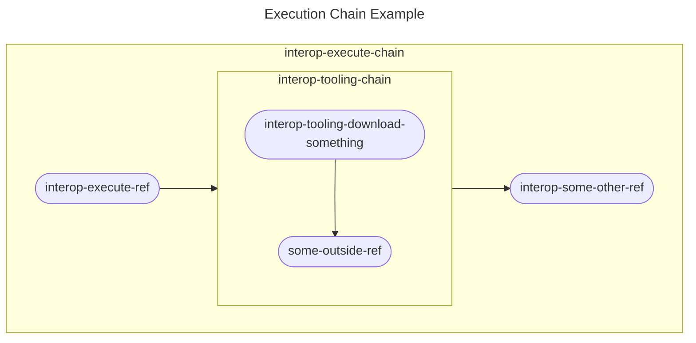

# OpenShift CI Scenario Test Execution Guide<!-- omit from toc -->

## Table of Contents<!-- omit from toc -->
- [Introduction](#introduction)
- [Scenario Execution](#scenario-execution)
  - [Using a Ref](#using-a-ref)
  - [Using a Chain](#using-a-chain)

## Introduction
This document aims to define and guide you through creating the "Execution" step of a scenario.

We define the Execution step of a scenario as:

> The execution of any interop tests in a scenario. This step should only consist of any setup that absolutely must occur in this step (rather than the [orchestration step](Orchestration_Guide.md)) and the execution of interop tests. The execution of these tests should result in one or more xUnit (xml) files.

Please follow the guide below to create the execution step of your scenario.

## Scenario Execution
In most situations, the execution step of a scenario would occur in a single ref. However, we recognize that this process is evolving as we onboard more scenarios. If your test execution will require more than a single ref, feel free to utilize a chain to complete this step of your scenario.

### Using a Ref
If a single ref is the best option for your scenario, use the following steps to create an execution ref:

1. In the [openshift/release](https://github.com/openshift/release) repository, create a folder for your scenario under `ci-operator/step-registry/interop` if one does not exist already.
   - **Example:** `ci-operator/step-registry/interop/mtr` 
2. In your new scenario folder, add a folder titled "execute".
   - **Example:** `ci-operator/step-registry/interop/mtr/execute`
3. Create the following files in your new "execute" folder:
   - `interop-{scenario name}-execute-ref.yaml`: This file is the OpenShift CI configuration file for this ref.
   - `interop-{scenario name}-execute-commands.sh`: This is the BASH script your new ref will execute.
   - `OWNERS`: This is a required file to outline who can approve changes to this ref. See the [official OpenShift CI documentation](https://docs.ci.openshift.org/docs/how-tos/onboarding-a-new-component/#repositories-under-existing-organizations) for more details.
   - `README.md`: Used to document your new ref. See the [Step Registry Documentation Policy](../../Policy/Documentation/Step_Registry_Documentation_Policy.md) for more information.
4. Populate the files you have created to create your execute ref:
   - See the instructions in the [Step Registry - Ref Guide](../Step_Registry/Step_Registry_Ref_Guide.md) for additional help.
5. Add the new ref to your scenario's chain.
   - **Note:** More information about this chain can be found in the [Scenarios Guide](Scenarios_Guide.md).
6. Add any required environment variables to the scenario's OpenShift CI configuration file:
   - **Note:** This is the file located in the `ci-operator/config/{test organization}/{test repository}` folder.
7. Run `make update` in the root of the `openshift/release` repository to update OpenShift CI's metadata files.

### Using a Chain
Below is a basic representation of what an execution chain could look like. This example is an execution chain that executes a ref, another chain, then another ref. This structure allows us to string reusable steps and scenario specific steps together to complete the execution step.

If you have decided that a chain is the best way to complete the execution step of your scenario, please use the steps below to create your execution chain:

1. In the [openshift/release](https://github.com/openshift/release) repository, create a folder for your scenario under `ci-operator/step-registry/interop` if one does not exist already.
   - **Example:** `ci-operator/step-registry/interop/mtr` 
2. In your new scenario folder, add a folder titled "execute".
   - **Example:** `ci-operator/step-registry/interop/mtr/execute`
3. Create the following files in your new "execute" folder:
   - `interop-{scenario name}-execute-chain.yaml`: This file is the OpenShift CI configuration file for this chain. You will be outline which steps to run and in what order here.
   - `OWNERS`: This is a required file to outline who can approve changes to this chain. See the [official OpenShift CI documentation](https://docs.ci.openshift.org/docs/how-tos/onboarding-a-new-component/#repositories-under-existing-organizations) for more details.
   - `README.md`: Used to document your new ref. See the [Step Registry Documentation Policy](../../Policy/Documentation/Step_Registry_Documentation_Policy.md) for more information.
4. Populate the files you have created to create your execute chain.
   - See the instructions in the [Step Registry - Chain Guide](../Step_Registry/Step_Registry_Chain_Guide.md) for additional help.
5. Add the new chain to your scenario's chain.
   - **Note:** More information about this chain can be found in the [Scenarios Guide](Scenarios_Guide.md).
6. Add any required environment variables to the scenario's OpenShift CI configuration file.
   - **Note:** This is the file located in the `ci-operator/config/{test organization}/{test repository}` folder.
7. Run `make update` in the root of the `openshift/release` repository to update OpenShift CI's metadata files.
