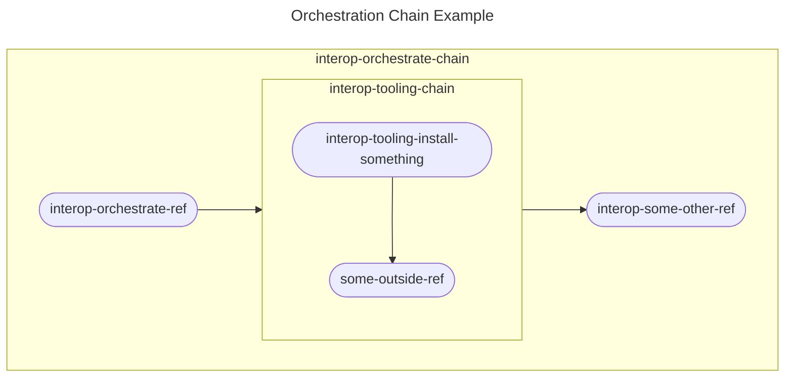

# OpenShift CI Scenario Test Orchestration Guide<!-- omit from toc -->

## Table of Contents<!-- omit from toc -->
- [Introduction](#introduction)
- [Scenario Orchestration](#scenario-orchestration)
  - [Using a Chain](#using-a-chain)
  - [Using a Ref](#using-a-ref)

## Introduction
This document aims to define and guide you through creating the "Orchestration" step of a scenario.

We define the Orchestration step of a scenario as:

> Completing any setup or configuration necessary to execute tests. This setup can include things like: installing an operator, retrieving any necessary variables, additional configuration of the test cluster, deployment of any necessary resources on the test cluster, etc.

Please follow the guide below to create the orchestration step of your scenario.

## Scenario Orchestration
There are a couple of ways to go about creating the orchestration step of a scenario, depending on the amount of work that need to be done during this step. If there isn't much work to be done and it can all be done in a single container using a single BASH script, a ref can be used for this step. If there is a lot of work to be done and you need to utilize steps that aren't specific to this scenario, you'll need to use a chain (most common).

### Using a Chain
This step of your scenario will likely use a chain considering this step usually requires the most work. A chain is really just a list of refs and/or chains that execute in order (see the [Step Registry Guide](../Step_Registry/Step_Registry_Guide.md) for more information). 

Below is a basic representation of what an orchestration chain could look like. This example is an orchestration chain that executes a ref, another chain, then another ref. This structure allows us to string reusable steps and scenario specific steps together to complete the orchestration step.

Use the steps below to create your orchestration chain:

1. In the [openshift/release](https://github.com/openshift/release) repository, create a folder for your scenario under `ci-operator/step-registry/interop` if one does not exist already.
   - **Example:** `ci-operator/step-registry/interop/mtr` 
2. In your new scenario folder, add a folder titled "orchestrate".
   - **Example:** `ci-operator/step-registry/interop/mtr/orchestrate`
3. Create the following files in your new "orchestrate" folder
   - `interop-{scenario name}-orchestrate-chain.yaml`: This file is the OpenShift CI configuration file for this chain. You will be outline which steps to run and in what order here.
   - `OWNERS`: This is a required file to outline who can approve changes to this chain. See the [official OpenShift CI documentation](https://docs.ci.openshift.org/docs/how-tos/onboarding-a-new-component/#repositories-under-existing-organizations) for more details.
   - `README.md`: Used to document your new ref. See the [Step Registry Documentation Policy](../../Policy/Documentation/Step_Registry_Documentation_Policy.md) for more information.
4. Populate the files you have created to create your orchestrate chain
   - See the instructions in the [Step Registry Guide](../Step_Registry/Step_Registry_Guide.md) for additional help
5. Add the new chain to the scenario's chain.
   - **Note:** More information about this chain can be found in the [Scenarios Guide](Scenarios_Guide.md)
6. Add any required environment variables to the scenario's OpenShift CI configuration file
   - **Note:** This is the file located in the `ci-operator/config/{test organization}/{test repository}` folder 
7. Run `make update` in the root of the `openshift/release` repository to update OpenShift CI's metadata files.

### Using a Ref
If you have decided that using a ref is the best option for your scenario, follow these steps to create the orchestration ref:

1. In the [openshift/release](https://github.com/openshift/release) repository, create a folder for your scenario under `ci-operator/step-registry/interop` if one does not exist already.
   - **Example:** `ci-operator/step-registry/interop/mtr` 
2. In your new scenario folder, add a folder titled "orchestrate".
   - **Example:** `ci-operator/step-registry/interop/mtr/orchestrate`
3. Create the following files in your new "orchestrate" folder
   - `interop-{scenario name}-orchestrate-ref.yaml`: This file is the OpenShift CI configuration file for this ref
   - `interop-{scenario name}-orchestrate-commands.sh`: This is the BASH script your new ref will execute
   - `OWNERS`: This is a required file to outline who can approve changes to this ref. See the [official OpenShift CI documentation](https://docs.ci.openshift.org/docs/how-tos/onboarding-a-new-component/#repositories-under-existing-organizations) for more details.
   - `README.md`: Used to document your new ref. See the [Step Registry Documentation Policy](../../Policy/Documentation/Step_Registry_Documentation_Policy.md) for more information.
4. Populate the files you have created to create your orchestrate ref
   - See the instructions in the [Step Registry Guide](../Step_Registry/Step_Registry_Guide.md) for additional help
5. Add the new chain to the scenario's chain.
   - **Note:** More information about this chain can be found in the [Scenarios Guide](Scenarios_Guide.md)
6. Add any required environment variables to the scenario's OpenShift CI configuration file
   - **Note:** This is the file located in the `ci-operator/config/{test organization}/{test repository}` folder
7. Run `make update` in the root of the `openshift/release` repository to update OpenShift CI's metadata files.