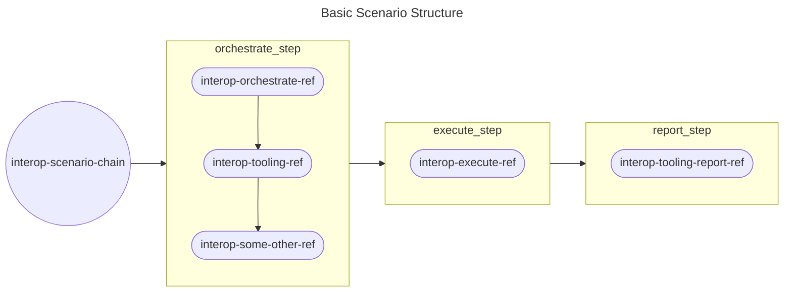

# (WIP) OpenShift CI Scenarios Guide<!-- omit from toc -->

## Table of Contents<!-- omit from toc -->
- [Overview](#overview)
- [Provision](#provision)
- [Orchestrate](#orchestrate)
- [Execute](#execute)
- [Report](#report)
- [Document](#document)
- [Production](#production)
  - [Remove Spot Instances](#remove-spot-instances)
  - [Ensure Trigger is Configured](#ensure-trigger-is-configured)
  - [Ensure Test execution output matches reporting](#ensure-test-execution-output-matches-reporting)
  - [Ensure all parties are OWNERS](#ensure-all-parties-are-owners)


## Overview
The following Headers are phases that MUST be done for each scenario. They are needed to provide a structure to the many OpenShift layered product scenarios that will be running on OpenShift CI.

Below is a basic flow chart of how a OpenShift CI scenario may look. Each scenario should have a chain where most of the work is completed. This chain should be named something like `interop-{product_name}-chain`. The scenario chain should execute the orchestrate, execute, and report steps in order. The orchestrate, execute, and report steps of a scenario's chain can either be another chain or a single ref depending on your scenario's specific needs.


## Provision
We define provision as:
> The initial setup of your scenarios files and the OpenShift installation

See the [Provision Guide](Provision_Guide.md) for detailed information meant to help you build the foundation of your scenario.

## Orchestrate
We define orchestrate as:

> Completing any setup or configuration necessary to execute tests. This setup can include things like: installing an operator, retrieving any necessary variables, additional configuration of the test cluster, deployment of any necessary resources on the test cluster, etc.

See the [Orchestration Guide](Orchestration_Guide.md)) for detailed information meant to help you organize the installation of your product.

## Execute
We define execute as:

> The execution of any interop tests in a scenario. This step should only consist of any setup that absolutely must occur in this step (rather than the [orchestration step](Orchestration_Guide.md)) and the execution of interop tests. The execution of these tests should result in one or more xUnit (xml) files.

See the [Execution Guide](Execution_Guide.md) for detailed information meant to help you organize your test execution.

## Report
TBD

See the [Reporting Guide](Reporting_Guide.md) for detailed information meant to help you report your test execution.

## Document
TBD

See the [Scenario Documentation Guide](../../Policy/Documentation/Scenario_Documentation_Policy.md) for detailed information meant to help you document your scenario.

## Production
This is meant to be a sort of final check just to make sure that you and your reviewers are aware of what needs to be done to push to production (a.k.a merging the PR).

### Remove Spot Instances
We cannot merge any code into the release repo meant to be used in production that is using [Spot Instances](#spot-instances). These can be unreliable and will lead to clusters going offline during production runs. We should be using them to save costs in development but when it is time to merge the scenario code we must ensure we remove the use of spot instances.

### Ensure Trigger is Configured
Without the proper cron setting for the scenario that we are testing the production runs will not be tested as expected. We need to review exactly when we need to trigger the scenario that we are working on and ensure the cron is correct.

For example for triggering at 1am every Monday we can use the following.
```
tests:
- as: cron-example
  cron: 0 1 * * 1
  steps:
    cluster_profile: aws-cspi-qe
    env:
      BASE_DOMAIN: aws.interop.ccitredhat.com
    workflow: cucushift-installer-rehearse-aws-ipi
```
A good way to verify your using what you expect to use for the value of cron you can use [Cronitor](https://crontab.guru/#0_1_*_*_1)

### Ensure Test execution output matches reporting
In order for us to merge a MR we need to be sure the E2E testing is working. This includes reporting the test results.

It is important that we verify the different levels of artifacts and make sure that they all align.

For example we might need to check the following:
- Console output (prow job)
- Pod logs
- XML artifacts
- TestGrid
- Report Portal
- Slack

There cannot be any discrepancies between these different places. If there is we need to halt the push to production and fix it.

### Ensure all parties are OWNERS
There is the [concept of OWNERS files within OpenShift CI's CI operator](https://docs.ci.openshift.org/docs/how-tos/onboarding-a-new-component/#repositories-under-existing-organizations) in the release repo. They are meant to hold the names of the people responsible for the code being added. This will allow them to be reviewers on future code changes. All members of responsible parties should be added to the OWNERS file.