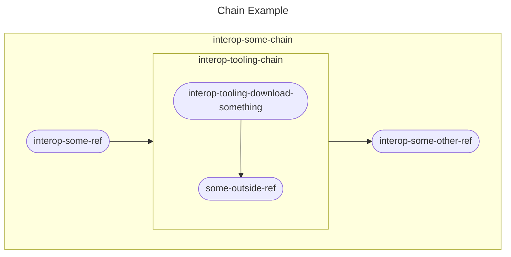

# Step Registry - Chain Guide<!-- omit from toc -->

## Table of Contents<!--omit from toc-->
- [Table of Contents](#table-of-contents)
- [What is a Chain?](#what-is-a-chain)
- [How to Create a Chain](#how-to-create-a-chain)
  - [Preparation](#preparation)
  - [Populating the Files](#populating-the-files)
    - [`new-step-chain.yaml`](#new-step-chainyaml)
    - [`OWNERS`](#owners)
    - [`README.md`](#readmemd)
  - [Finalization](#finalization)

## What is a Chain?
A chain allows you to string refs and other chains together to be executed in order. Chains are useful to help keep configurations clean and useful. When we create a scenario's chain to follow the "orchestrate, execute, report" structure that CSPI follows, it allows us to see the whole scenario in one configuration file and may prevent some confusion. 

Below is a basic representation of what a chain could look like:


This example shows a chain that executes a ref, another chain, then another ref in order.

## How to Create a Chain
Creating a chain is fairly easy and is comprised of 4 files:

- **Configuration File**: A YAML file used to define the name, steps, and required environment variables of the chain.
- **OWNERS file:** A file used by OpenShift GitHub robots as a list of users who are allowed to approve or deny changes to a step.
- **README.md (CSPI requirement):** A documentation file written in Markdown. While not required by OpenShift CI, this is a CSPI requirement.
- **OpenShift CI Metadata file:** An autogenerated file used by OpenShift CI internally.

### Preparation
1. In the [openshift/release](https://github.com/openshift/release) repository, create a folder for your chain under `ci-operator/step-registry/` if suitable a folder does not exist already.
   - **Example:** `ci-operator/step-registry/new-step` 
2. Create the following files in your new folder.
   - `new-step-chain.yaml`
   - `OWNERS`
   - `README.md`

> **IMPORTANT:**
>
> When creating the `.yaml` file in step 2 above, please keep in mind that it must follow a naming standard or OpenShift CI will not accept it. You'll notice the folder I created is named "new-step", the `.yaml` file needs to start with that name and end with `-chain.yaml`.
>
> If you create the new folder for your chain in an existing folder under `ci-operator/step-registry/`, you must include the name of the parent folder in the name as well. For example, if you created the `new-step` folder under `ci-operator/step-registry/existing-folder`, the name of your file would be `existing-folder-new-step-chain.yaml`.

### Populating the Files

#### `new-step-chain.yaml`
This file is meant to serve as the configuration file for the new chain being created. This file outlines:
- The name of the chain.
- Steps you'd like to run.
- Required environment variables.

Please use the mock-up and the guide below to populate your chain's configuration file:

```yaml
chain:
  as: new-step
  steps:
  - ref: interop-some-ref
  - chain: interop-tooling-chain
  - ref: interop-some-other-ref
  env:
  - name: SOME_VARIABLE
    default: "This is the default for SOME_VARIABLE"
    documentation: |-
      A really cool variable used for really cool things.
  documentation: |-
    A sample chain that runs some refs and a chain
```
The chain configuration above runs a ref, another chain, and then another ref.

Here is how we define and get each of the values in the configuration above:

- `as:` This is the name of the chain. You'll notice it is just the name of the configuration file sans the `-chain.yaml` ending. This is also how you will call this chain to be executed in other chains, [workflows](Step_Registry_Workflow_Guide.md), or test configuration files.
- `steps:` This stanza defines the list of steps, in order, you'd like this chain to execute.
  - `ref:` Specify a ref to be run using the name of the ref.
  - `chain:` Specify a chain to be run using the name of the chain.
- `env:` This stanza defines a list of environment variables needed for the refs and chains in the `steps:` stanza to execute. These environment variables should be defined in the configuration files of the refs and chains you'd like to run.**Optional**
  - `name:` Defines the name of an environment variable.
  - `default:` Defines the default value of the environment variable if one is not provided. **Optional**
  - `documentation:` A short description of the environment variable and what it is used for.
- `documentation:` The value of this should be a short description of the chain to be used in the [autogenerated documentation](../../Policy/Documentation/Step_Registry_Documentation_Policy.md#automatically-generated-documentation) in OpenShift CI.

#### `OWNERS`
Follow the instructions in the ["OWNERS File" section of the Step Registry Guide](Step_Registry_Guide.md#owners-file).

#### `README.md`
Follow the instructions in the [Step Registry Documentation Policy](../../Policy/Documentation/Step_Registry_Documentation_Policy.md) document.

### Finalization
Once you have populated all of the files for your chain, make sure to run the `make update` command in the root of your local clone of the [openshift/release](https://github.com/openshift/release) repository. This command will create all of the necessary metadata files that OpenShift CI uses to execute your new chain. This command will also alert you to any errors in your configuration file and tell you how to fix them.

> **NOTE:**
>
> If running this command returns a permissions error, please try to run it using `sudo`.